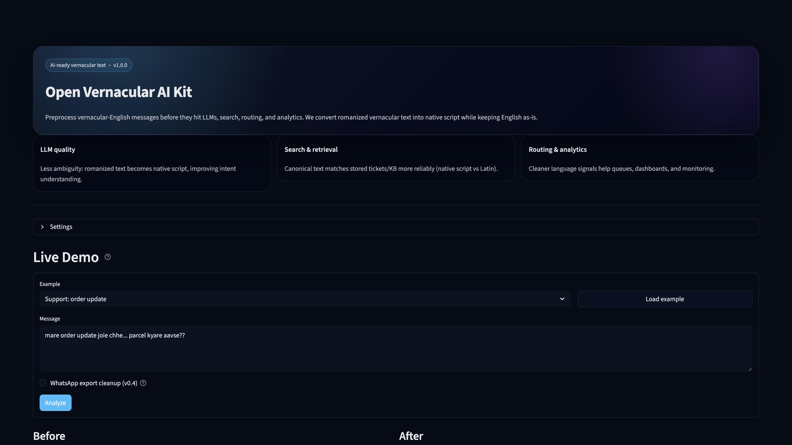
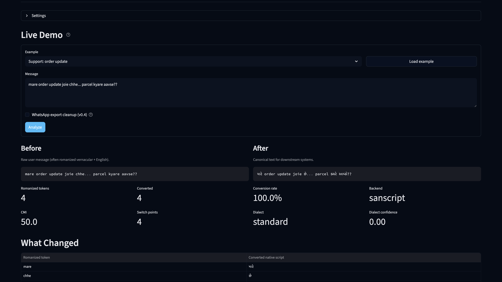
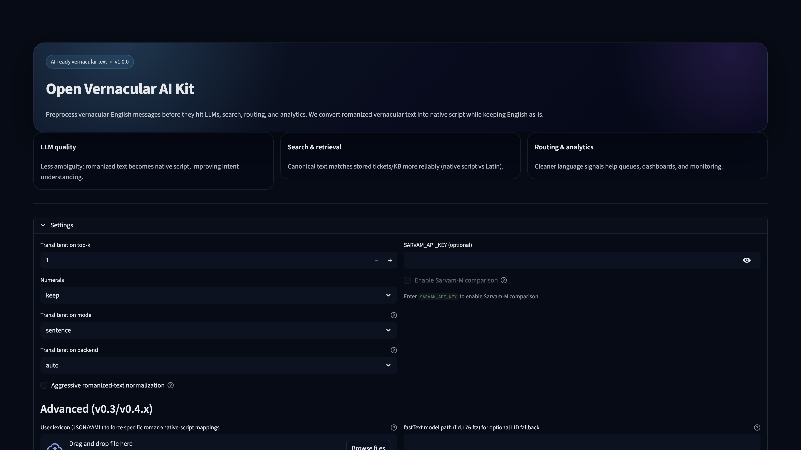
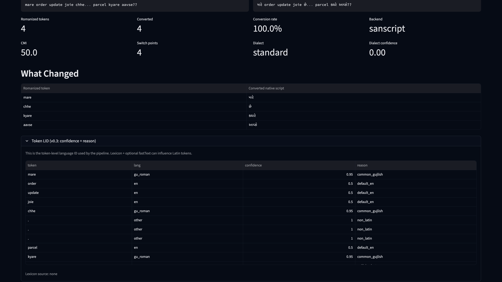
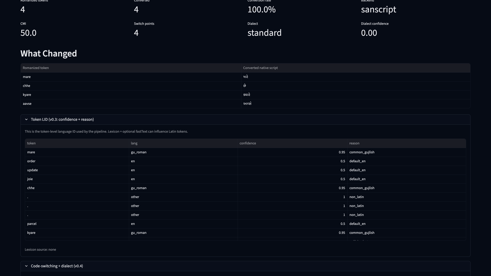
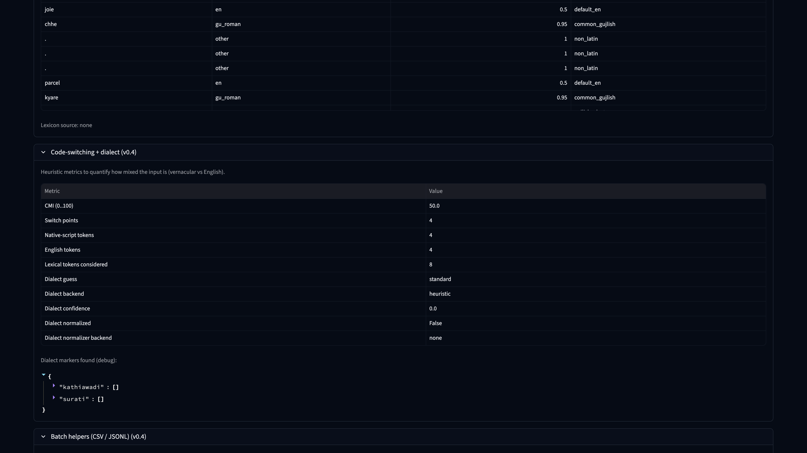

 # Open Vernacular AI Kit

[](https://github.com/SudhirGadhvi/open-vernacular-ai-kit/actions/workflows/ci.yml)
[](https://sudhirgadhvi.github.io/open-vernacular-ai-kit/)
[](pyproject.toml)
[](pyproject.toml)
 
 `open-vernacular-ai-kit` is an open-source SDK + CLI for cleaning up Indian vernacular-English code-mixed
 text. This release is India-first with Sarvam AI integrations, and is designed to expand globally in
 future updates with community-contributed language and provider adapters.
 It is designed for messy WhatsApp-style inputs where vernacular text might appear in:
 
 - native script (example: ગુજરાતી)
 - Romanized vernacular text (example: Gujlish)
 - Mixed script in the same sentence
 
The goal is to normalize text *before* sending it to downstream models (Sarvam-M / Mayura /
Sarvam-Translate), and to provide a reusable open-source foundation for vernacular AI workflows.
Global language/provider expansion (OpenAI, Claude, and others) is planned and PR-friendly.

This repo is alpha-quality but SDK-first: the public API centers on `CodeMixConfig` + `CodeMixPipeline`.

Quick example:

```bash
gck codemix "maru business plan ready chhe!!!"
# -> મારું business plan ready છે!!
```

## Hard Cases (WhatsApp-Style)

Canonical output format (Gujarati-first profile):

- Native-script tokens stay in their native script
- English stays in Latin
- Romanized vernacular tokens are transliterated to native script when possible

| Input (messy) | Output (canonical code-mix) |
| --- | --- |
| `maru business plan ready chhe!!!` | `મારું business plan ready છે!!` |
| `maru mobile number 123 chhe` | `મારું mobile number 123 છે` |
| `maru order confirm chhe` | `મારું order confirm છે` |
| `aaje maru kaam ready chhe` | `આજે મારું કામ ready છે` |
| `tame ok chho?` | `તમે ok છો?` |

Note: outputs depend on the selected transliteration backend and configuration. Use `--stats` to log
what happened (backend used, how many romanized vernacular tokens were transliterated, etc). For stricter
"keep English as English" behavior, consider enabling an optional Latin-token LID backend (see docs).

## Reproducible Eval (Gujarati Baseline)

This repo includes a lightweight "coverage-style" eval harness (not translation quality) for the
current Gujarati baseline:

```bash
gck eval --dataset gujlish --report eval/out/report.json
```

Example result from one local run (topk=1, max_rows=2000):

- Split `in22`: `pct_has_gujarati_codemix` ~= `0.987`
- Split `xnli`: `pct_has_gujarati_codemix` ~= `0.956`

See `docs/benchmarks.md` for details.

## Indian Language Coverage (This Release)

Current scope: India-first release. Gujarati is production-ready in this repo today; other Scheduled
Indian languages are planned next and open for community PRs.

| Language | Ready | Partially Ready | Planned (PR welcome) |
| --- | --- | --- | --- |
| Assamese | ⬜ | ⬜ | ✅ |
| Bengali | ⬜ | ⬜ | ✅ |
| Bodo | ⬜ | ⬜ | ✅ |
| Dogri | ⬜ | ⬜ | ✅ |
| Gujarati | ✅ | ⬜ | ⬜ |
| Hindi | ⬜ | ⬜ | ✅ |
| Kannada | ⬜ | ⬜ | ✅ |
| Kashmiri | ⬜ | ⬜ | ✅ |
| Konkani | ⬜ | ⬜ | ✅ |
| Maithili | ⬜ | ⬜ | ✅ |
| Malayalam | ⬜ | ⬜ | ✅ |
| Manipuri | ⬜ | ⬜ | ✅ |
| Marathi | ⬜ | ⬜ | ✅ |
| Nepali | ⬜ | ⬜ | ✅ |
| Odia | ⬜ | ⬜ | ✅ |
| Punjabi | ⬜ | ⬜ | ✅ |
| Sanskrit | ⬜ | ⬜ | ✅ |
| Santali | ⬜ | ⬜ | ✅ |
| Sindhi | ⬜ | ⬜ | ✅ |
| Tamil | ⬜ | ⬜ | ✅ |
| Telugu | ⬜ | ⬜ | ✅ |
| Urdu | ⬜ | ⬜ | ✅ |

## Contribute

This release focuses on Indian languages and Sarvam-first hosted API flows.
If you want to help expand global language coverage or add provider adapters (OpenAI, Claude, etc.),
open a GitHub issue or submit a PR.

## Open-Source Governance

This repository now includes a full public OSS governance baseline:

- Contribution workflow: `CONTRIBUTING.md`
- Security reporting policy: `SECURITY.md`
- Community behavior policy: `CODE_OF_CONDUCT.md`
- Support channels: `SUPPORT.md`
- Ownership/review routing: `.github/CODEOWNERS`
- PR and issue intake templates: `.github/pull_request_template.md`, `.github/ISSUE_TEMPLATE/`
- Dependency update automation: `.github/dependabot.yml`
- Release and RC process: `RELEASE.md`
- Maintainer model and merge policy: `GOVERNANCE.md`

## Repository Rename Notes

Repository target name for this release: `open-vernacular-ai-kit`.

If your local clone still points to the old remote, update it:

```bash
git remote set-url origin https://github.com/SudhirGadhvi/open-vernacular-ai-kit.git
git remote -v
```

Compatibility note: Python import path is `open_vernacular_ai_kit`.
 
 ## Install
 
 For full functionality (recommended):
 
 ```bash
python3 -m venv .venv
.venv/bin/python -m pip install -U pip
.venv/bin/pip install -e ".[indic,ml,eval,demo,dev,dialect-ml,rag]"
 ```
 
 Minimal (CLI + basic heuristics only):
 
 ```bash
 pip install -e .
 ```
 
 ## CLI
 
 Normalize text:
 
 ```bash
 gck normalize "મારું business plan ready છે!!!"
 ```
 
Render clean code-mix (native-script tokens preserved, English preserved):
 
 ```bash
 gck codemix "maru business plan ready chhe!!!"
 ```
 
Canonical output format (Gujarati-first profile):

- Native-script tokens stay in native script
- English stays in Latin
- Romanized vernacular tokens are transliterated to native script when possible

Quick success metric (% Gujlish tokens transliterated):

```bash
gck codemix --stats "maru business plan ready chhe!!!" 1>/dev/null
```

Run eval (downloads public Gujlish eval CSVs into `~/.cache/open-vernacular-ai-kit`):

```bash
gck eval --dataset gujlish --report eval/out/report.json
```

Dialect evals (uses a tiny packaged JSONL by default, or provide your own):

```bash
gck eval --dataset dialect_id
gck eval --dataset dialect_normalization
```

 ## Demo (Streamlit)
 
### Run On Localhost

1. Create and activate a virtual environment:

```bash
python3 -m venv .venv
source .venv/bin/activate
python -m pip install -U pip
```

2. Install demo dependencies:

```bash
pip install -e ".[demo,indic]"
```

3. Start the demo server:

```bash
.venv/bin/streamlit run demo/streamlit_app.py
```

4. Open in browser:

```text
http://localhost:8501
```

Optional (enable Sarvam AI comparison in the UI):

```bash
pip install -e ".[sarvam]"
export SARVAM_API_KEY="your_key_here"
```

Then restart:

 ```bash
 streamlit run demo/streamlit_app.py
 ```
 
 If you export `SARVAM_API_KEY`, the demo can optionally call Sarvam APIs.

### Troubleshooting (Local Demo)

- **`streamlit: command not found`**
  - Run with virtualenv binary:
  ```bash
  .venv/bin/streamlit run demo/streamlit_app.py
  ```

- **Port `8501` already in use**
  - Start on a different port:
  ```bash
  .venv/bin/streamlit run demo/streamlit_app.py --server.port 8502
  ```
  - Then open `http://localhost:8502`.

- **Import/dependency errors in demo**
  - Reinstall required extras:
  ```bash
  pip install -e ".[demo,indic]"
  ```
  - For Sarvam features:
  ```bash
  pip install -e ".[sarvam]"
  ```

### Demo Screenshots

#### 1) Landing / value overview



What this shows:
- The app focus: normalize mixed vernacular + English text before LLM/search/routing.
- Product value areas: LLM quality, retrieval quality, and analytics signal cleanup.
- Starting point before running any analysis.

#### 2) Live analysis (Before -> After)



What this shows:
- A raw romanized message in **Before**.
- Canonicalized output in **After** with native-script conversions.
- Conversion metrics (romanized tokens, converted count, conversion rate, backend).
- Token-level changes table to inspect exactly what was transformed.

#### 3) RAG section


What this shows:
- The India-focused mini-KB retrieval panel.
- Query input, preprocessing toggle, embeddings mode, and top-k controls.
- A quick way to test retrieval quality on canonicalized inputs.

#### 4) Settings panel (expanded)



What this shows:
- Full runtime controls for transliteration, numerals, backends, and model options.
- Sarvam comparison toggles and advanced dialect-related settings.
- The main place to configure behavior before running analysis.

#### 5) Token LID panel (expanded)



What this shows:
- Token-by-token language tags and confidence scores.
- Why each token was classified as native script, romanized, English, or other.
- Useful for debugging lexicon rules and transliteration decisions.

#### 6) Code-switching + dialect panel (expanded)



What this shows:
- CMI/switch-point metrics for mixed-language inputs.
- Detected dialect label and confidence.
- Quick diagnostics to understand how mixed or dialect-heavy an input is.

#### 7) Batch helpers panel (expanded)



What this shows:
- CSV and JSONL upload flows for bulk preprocessing.
- Download-ready processed outputs for production pipelines.
- The easiest way to run large input sets through the same normalization logic.

### How To Use The Demo

1. Open the app and load an example (or paste your own user message).
2. Click **Analyze** to produce canonical text and conversion metrics.
3. Review **Before vs After** and the **What Changed** table.
4. (Optional) Open **RAG** and run retrieval on the same canonicalized text.
5. (Optional) Add `SARVAM_API_KEY` to enable model comparison in the AI section.

## RAG Utilities (v0.5)

v0.5 adds small, optional RAG helpers intended for tiny curated corpora and demos:

- `RagIndex`: build a small embeddings index and do top-k retrieval
- `load_vernacular_facts_tiny()`: packaged India-focused mini dataset (docs + queries) for quick recall evals and demos
- `download_vernacular_facts_dataset(...)`: opt-in download helper (URLs required; offline-first by default)

To enable HF embedding models:

```bash
.venv/bin/pip install -e ".[rag-embeddings]"
```

Example (keyword embedder, no ML deps):

```python
from open_vernacular_ai_kit import RagIndex, load_vernacular_facts_tiny

ds = load_vernacular_facts_tiny()

def keyword_embed(texts: list[str]) -> list[list[float]]:
    keys = ["gujarati", "hindi", "tamil", "kannada", "bengali", "marathi"]
    return [[1.0 if k in (t or "").lower() else 0.0 for k in keys] for t in texts]

idx = RagIndex.build(docs=ds.docs, embed_texts=keyword_embed, embedding_model="keywords")
hits = idx.search(
    query="which language is commonly used in gujarat customer support workflows (gujarati)?",
    embed_texts=keyword_embed,
    topk=3,
)
print([h.doc_id for h in hits])
```

## Dialects (Full SDK)

Dialect support is offline-first and pluggable:

- Dialect ID backends: `heuristic` (default), `transformers` (fine-tuned model), `none`
- Dialect normalization backends: `heuristic` (rules), `seq2seq` (optional), `auto` (rules + optional seq2seq)

Safety default: remote HuggingFace model downloads are disabled unless you explicitly enable them:

- SDK: `allow_remote_models=False` (default)
- Demo: "Allow remote model downloads" checkbox (off by default)

Example (heuristic dialect normalization gated by confidence):

```python
from open_vernacular_ai_kit import analyze_codemix

a = analyze_codemix(
    "kamaad thaalu rakhje",
    dialect_backend="heuristic",
    dialect_normalize=True,
    dialect_min_confidence=0.7,
)
print(a.codemix)
```

## Training (Optional)

This repo includes simple training scripts (you provide data):

```bash
python3 scripts/train_dialect_id.py --train path/to/dialect_id_train.jsonl --output-dir out/dialect_id
python3 scripts/train_dialect_normalizer.py --train path/to/dialect_norm_train.jsonl --output-dir out/dialect_norm
```
 
 ## Disclaimer
 
This is alpha software. Core code-mix rendering is designed to be stable, but dialect detection and
normalization are limited by available labeled data and model choices.
 
